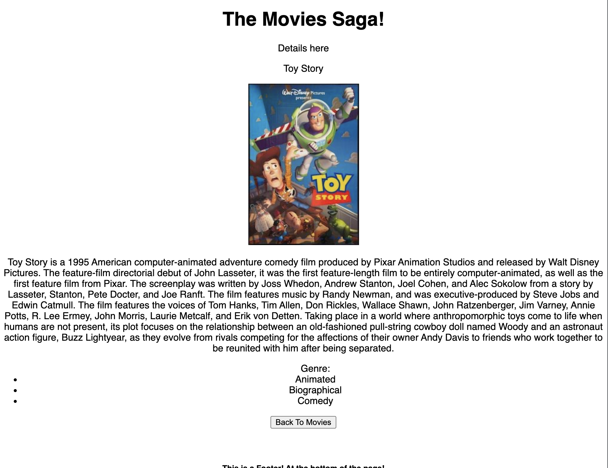

# Movie Sagas

## Description

_Duration: 2 Day Sprint_

This is an app to display a list of movies, each movie identified by a title and a poster. Each movie poster Is clickable to reveal additional details, such as a brief synopsis and associated genres. There is also a form to add a new movie. 
The information for the movie list and details is retrieved from a database and, temporarliy in a reducer for each individual movie clicked on for detail view. 
Form data also pulls from the database to populate the genre selector.

To see the fully functional site, please visit: [DEPLOYED VERSION OF APP](www.heroku.com)

## Screen Shot

Here's an example of the detail page for a movie 

### Prerequisites

Software that is required to install the app:

- [Node.js](https://nodejs.org/en/)
- List other prerequisites here

## Installation

1. Create a database named `saga_movies_weekend`,
2. The queries in the `database.sql` file are set up to create all the necessary tables and populate the needed data to allow the application to run correctly. The project is built on [Postgres](https://www.postgresql.org/download/), so you will need to make sure to have that installed. We recommend using Postico to run those queries as that was used to create the queries, 
3. Open up your editor of choice and run an `npm install`
4. Run `npm run server` in your terminal
5. Run `npm run client` in your terminal
6. The `npm run client` command will open up a new browser tab for you!

## Usage
How does someone use this application? Tell a user story here.

1. Scroll through the listed movie posters on the landing page
2. Click on one to view detailed synopsis.
3. Click 'Back to Movies' button to return to the list .
4. Click 'Add a New Movie' to go to fill out a form with new movie information.
5. Click 'Save Movie' when form is complete to add the movie
6. Or click 'Cancel' to return to the movie list without adding.

## Built With

1. React
2. Redux
3. Axios/Ajax
4. JavaScript
5. Node.js

## Acknowledgement
Thanks to [Prime Digital Academy](www.primeacademy.io) who equipped and helped me to make this application a reality. Thanks Kris S, Chris B, Chris H, and Chris M.

## Support
If you have suggestions or issues, leave me a message on my message machine.